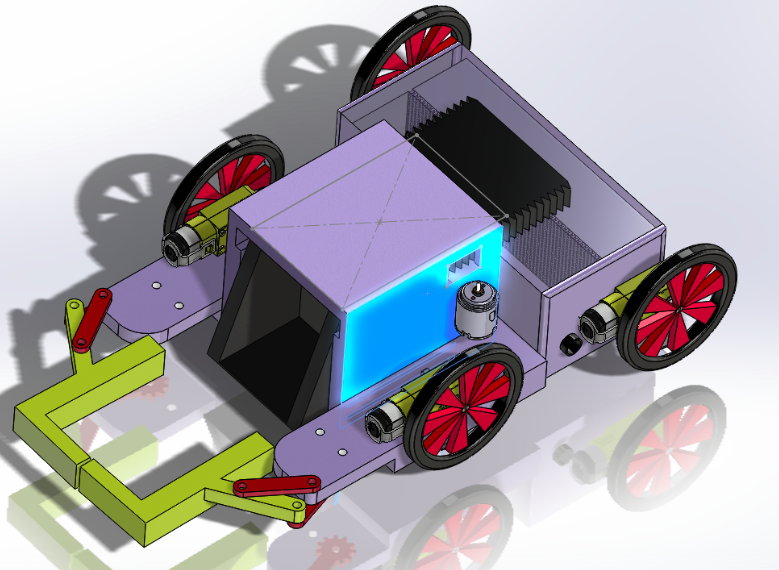

# Cleaner-Bot

This repository contains the CAD models, DXF files used for laser cutting, followed by the code used to control the robot. The projects aim was to design and implement a new design as an alternative to the currently existing cleaner robots. 

For prezi presentation click [here](https://prezi.com/view/AhR2JavvCEbZ34JITC9l/)
Youtube video [Link](https://youtu.be/4qz2bjRoqZo)

## Table of Contents
1. [Design Phases](#Design-Phases)
2. [Simulation](#simulation)
3. [Laser Cutting Images](#laser-cut-images)
4. [Assembly](#assembly)

## Design Phases
This section we will discuss about the different stages the robot design process went through.

## Design 1

The above picture is the initial design for the cleaner robot. It accomplished our objective of making the setup small. Still, there exited a problem as very little space is available to keep electronic components. Also, no vacuum chamber that would collect the fine dust, which currently commercialized robots already do. For these reasons, we started designing the next model.

## Design 2 
  

Keeping in mind the drawbacks of the previous model, we added a vacuum chamber, and the electronics were moved from the front to the back. But there was a considerable drawback of this design, including the electronics at the back made the robot long, which includes the arms in closed form. Also, we concluded that the linearly actuated front bin was taking up too much space and would be very hard to manufacture, as 3D-printed gears would have difficulty meshing if not made properly. Thus the final design came into existence.

## Design 3 

The above picture represents a minimalistic design. It includes all the main components we wanted. The front bin was removed, and a flap-like structure was made. The arms were changed so they could come as close to the body as possible. This design was finalized for manufacturing.

## Simulation

The above is a small simulation of the arm trajectories used to pick the 4 bar mechanisms configuration. The same configuration was used for all the designs.

## Laser Cutting Images
  

The above images are the screenshots from the DXF files used as inputs into the laser cutter. The 3D assembly was converted into various 2D parts, and the teeth were added to these 2D projections.

After acquiring the required material, the acrylic was laser cut, as shown above.

## Assembly 

The above image is the assembly of the laser cut parts. Various types of L clamps were used for assembly.

 

These 2 images are the front and top view of the final robot with electronics. After the final assembly, we realized that wiring should also be considered when the next model is made. The front arms were 3D printed, and the flap was made using cardboard as the servo we are using has a low torque rating, so the flap should be light.

This is the back picture of the robot. There is a motor driver, a Lipo, RPi, and a trigger switch. We initially thought of using an Arduino nano, but there were not enough pins, and the RPi allows us to control the robot using SSH.   

